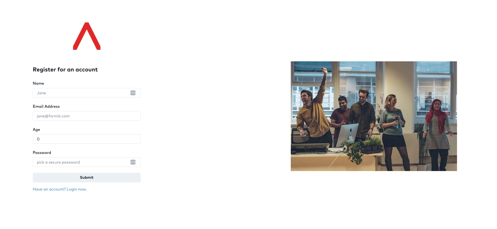

# Team-RYMP-Project
Welcome to Team RYMP's final project.
This READ ME will walk you through how to setup and utilise our project.

This Project will allow the user to deploy a full-stack application to the AWS cloud and be able to interact with it.

We have created a fully functioning infrastructure using Infrastrcutre as Code(IAC) via Terraform. To use this code make sure you have terraform installed and have authorised your terminal with your AWS credentials.

Then enter,
```
terraform init
```
Followed by,
```
terraform plan
```
And finally 
```
terraform apply
```
This proccess can take at least 15 to 20 minutes so please be patient.

Once the terraform has applied you now are ready to deplpoy the application onto the EKS cluster created via terraform but first you need to alter your kubernetes context. This can be done by using this code snippet.

Remember to replace 'eu-west-2' with your region and 'rymp-eks-cluster' with the name you have changed your EKS cluster to. If you are using the same regoin and cluster names then no changes are neccessary.
```
aws eks --region eu-west-2 update-kubeconfig --name rymp-eks-cluster
```

Now that terraform infrastructure is created we can move on to the deployment of our frontend and backend applications.

Firstly with backend there are 3 environment variables that are required to link the backend application to the RDS. These are 
```
- name: SPRING_DATASOURCE_URL
          value: "jdbc:postgresql://YOUR_RDS_DNS:5432/rymp_database"
        - name: SPRING_DATASOURCE_USERNAME
          value: "YOUR_RDS_USERNAME"
        - name: SPRING_DATASOURCE_PASSWORD
          value: "YOUR_RDS_PASSWORD"
```
Repalce the values with your own however we recommend using 'postgres' for the RDS username as this prevents future issues down the line. These values will be injected into the backend application yaml file to set up the connection with the RDS instance and allow them to communicate.

Moving on to the frontend deployment there is only 1 environemnt variable to inject which is 
```
- name: VITE_API_BASE_URL
          value: "YOUR_LB_DNS:8080"
```
Here you will add your publicly available Load Balancer DNS which will connect the frontend to the backend allowing users to login/signup using the frontend application.

Now that all the deployment files are ready to be used

To deploy them use the command 
```
kubectl apply -f YOUR_FILE_NAME
```

We have future plans to implement continuos deployment

Once you have deployed the 2 applications to your EKS cluster you should be able to access the frontend via the load balancer created via the service yaml. This can be acquired either by using the command ```kubectl get services``` or logging into your AWS console and finding the load balancer DNS displayed on your account.



At this point you should also be able to see the connections being made to your RDS instance on the AWS Console.


You should then be able to sign-up or login if you have already made an account and also alter the details of any users that have signed up or even remove them all together.

If you have followed all of these steps correctly you should be able access this screen which shows all the users in your database.


If you can reach this screen congratulations you're frontend and backend are all linked up and communicating with your database to create a fully fucntioning application!


